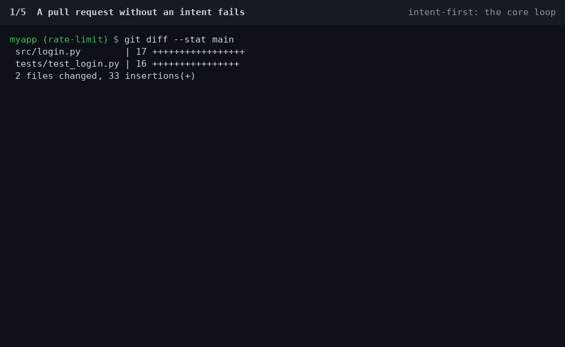

# intent-first

Commit the why: every pull request carries a short intent file, and CI checks the change against it.

[](https://github.com/ao3575911/intent-first/actions/workflows/proof-carrying-pr.yml?query=branch%3Amain)
[](https://github.com/ao3575911/intent-first/releases/latest)
[](LICENSE)

Git remembers what changed but not why. Now that agents write most of the diff, the instruction behind it is the part worth keeping, and today it ends up in a chat log. intent-first keeps it in the repo. Each pull request carries one short file: what I want, what I don't want, and how we'll know it's done. CI runs the "done when" checks and won't merge without it. Later, `git why file:line` shows the intent behind any line.

It's a GitHub Action and a small Python script, with no LLM, no API key and no service. It's not a planning framework; use spec-kit or anything else for that. This is the record of why each change exists, kept next to the code.



## The loop

1. A pull request without an intent fails the `intent-check` status check.
2. You add a short intent file. `git why --init <slug>` writes the template.
3. CI runs the intent's `check:` lines. They pass, and so does the gate.
4. You merge.
5. Months later, `git why file:line` shows the intent behind that line.

## git blame vs git why

`git blame` tells you who touched a line and when:

```console
$ git blame -L 11,11 src/login.py
62167043 (Adam 2026-10-04 02:29:06 +0800 11)     return len(recent) < LIMIT
```

`git why` tells you what the change was for, what it was not allowed to do, and how it was checked:

```console
$ git why src/login.py:11
src/login.py:11  6216704  2026-10-04  Adam
  Rate-limit failed logins

Intent     20261004-rate-limit-login  (shipped)
Title      Rate-limit failed logins
Found via  intent file added by merge c63c3b4
PR         #1
File       .intent/20261004-rate-limit-login.md

Want
  At most 5 failed logins per IP per minute.

Not
  No CAPTCHA. No lockout for users who log in successfully.

Done when
  - Limiter tests pass
    check: `python3 -m unittest discover -s tests`
```

Both outputs are from the same throwaway repo as the GIF.

## Quickstart

Add `.github/workflows/intent-check.yml`, then make `intent-check` a required status check:

```yaml
name: intent-check
on:
  pull_request:
    types: [opened, synchronize, reopened, edited, labeled, unlabeled]
permissions:
  contents: read
jobs:
  intent-check:
    runs-on: ubuntu-latest
    steps:
      - uses: actions/checkout@v5
        with: {fetch-depth: 0}
      # Set up whatever your check: lines need here, e.g. actions/setup-node or actions/setup-python.
      - uses: ao3575911/intent-first@v1
```

The action doesn't install toolchains. If your `check:` lines run `npm test` or `go test`, add the setup steps for them before the action.

Put your first intent in the same PR, and list the workflow file in its `touches:`, for example `touches: [.github/workflows/intent-check.yml]`. Otherwise the gate warns that the workflow file is outside the intent's scope (and fails with `strict-touches: "true"`). The warning is right: the workflow is part of that PR's change.

## The intent format

One file per change, at `.intent/YYYYMMDD-slug.md`:

```markdown
---
id: 20260928-rate-limit-login
status: draft
touches: [src/, tests/]
---
# Rate-limit failed logins

## Want
Max 5 failed logins per IP per minute.

## Not
No CAPTCHA. No lockout for users who log in successfully.

## Done when
- Limiter unit tests pass
  check: `python3 -m unittest discover -s tests`
- p95 login latency unchanged
```

`touches:` can also be a block list (`touches:` followed by `- src/` lines), and section headings are matched regardless of case.

### Rules

- **One PR, one intent.** A PR adds exactly one intent, or references one draft with an `Intent: <id>` line in the PR body or a commit trailer.
- **Shipped is immutable.** Once `status: shipped` is on main, the file can't change. To change a decision, add a new intent with `supersedes: <old-id>`.
- **Done when is checked.** CI runs each `check:` command and fails the PR on a non-zero exit. Bullets without one go to human review.
- **Stay in scope.** Paths outside `touches:` get a warning, or fail with `strict-touches: "true"`.

### Draft and shipped

Nothing flips the status for you. The gate only enforces what each status means:

- `draft`: later PRs may edit the file, and a follow-up PR can point at it with `Intent: <id>` instead of adding a new one.
- `shipped`: locked once it's on main. A PR that edits it, or points at it with `Intent: <id>`, fails.

So set `status: shipped` in the PR that finishes the work. If one PR does the whole job, commit the intent as `shipped` in that PR. If the work spans several PRs, flip `draft` to `shipped` in the last one; the gate notes the flip. You don't need a separate "mark shipped" PR. An intent left as `draft` still works; it just stays editable.

## git why

Install it once. Git picks up any `git-why` on your `PATH` as `git why`:

```sh
mkdir -p ~/.local/bin
curl -fsSL https://raw.githubusercontent.com/ao3575911/intent-first/v1/bin/git-why -o ~/.local/bin/git-why && chmod +x ~/.local/bin/git-why
# If ~/.local/bin isn't on your PATH yet, add this to your shell profile:
export PATH="$HOME/.local/bin:$PATH"
```

```sh
git why src/ratelimit.py:21        # commit, intent, status, PR, supersede chain, Want / Not / Done when
git why --init rate-limit-login    # writes .intent/<today>-rate-limit-login.md from a template
```

`git why` reads the `Intent: <id>` or `Claims: <id>` trailer on the commit, its merge commit or the PR's other commits, or the intent file the change added. After a squash merge where the trailer lives only in the PR body, it asks GitHub through `gh` if it's installed; set `GIT_WHY_NO_GH=1` or pass `--no-gh` to stay offline.

## Run the gate locally

The gate is one Python file with no dependencies. Run it before you push:

```sh
curl -fsSL https://raw.githubusercontent.com/ao3575911/intent-first/v1/scripts/intent_check.py -o /tmp/intent_check.py
python3 /tmp/intent_check.py --base origin/main --head HEAD --run-checks
```

Add `--pr-body-file body.md` to test an `Intent: <id>` line in a PR description.

## Skipping the gate

Some PRs don't need an intent. The action skips the gate, and passes with a notice that says why, when:

- the PR author is in `exempt-authors` (default `dependabot[bot],renovate[bot]`),
- the PR has the `skip-label` label (default `no-intent`), or
- every changed file matches `exempt-paths` (globs, empty by default).

```yaml
      - uses: ao3575911/intent-first@v1
        with:
          exempt-paths: "**/*.md, docs/"   # PRs that only touch docs don't need an intent
```

In `exempt-paths`, `*` stays inside one folder, `**` spans folders, and a trailing `/` means the whole folder. A PR that changes `.intent/` is never skipped, so the immutability rules always apply. Keep `labeled` and `unlabeled` in the workflow's `types:` so adding the label re-runs the check.

You can also skip the whole job with a job-level `if:`. GitHub reports a skipped job as passing, so a required `intent-check` doesn't block the PR:

```yaml
jobs:
  intent-check:
    if: github.event.pull_request.user.login != 'dependabot[bot]' && !contains(github.event.pull_request.labels.*.name, 'no-intent')
```

## Coding agents

Copy [docs/AGENTS-snippet.md](docs/AGENTS-snippet.md) into your `AGENTS.md`, `CLAUDE.md` or `.github/copilot-instructions.md`. It tells the agent to write the intent first, stay inside `touches:` and add `check:` lines, so the instruction you gave it becomes a reviewed file that CI enforces.

## Is this for me?

It fits if pull requests are how changes land, agents or several people write them, and you want the reason for each change kept next to the code and checked by CI. The cost is one file of about 15 lines per PR.

When not to use it:

- You push straight to main, or you work alone and your commit messages already say why.
- Most of your PRs are trivial and you don't want to set up `exempt-paths` or a label for them.
- You want a planning workflow (spec, plan, tasks). Use spec-kit or OpenSpec; intent-first can sit next to them.
- You want every prompt and agent session captured automatically. That's what [git-ai](https://github.com/git-ai-project/git-ai) or [entire](https://github.com/entireio/cli) are for.

## Compared with

| | What it is | Enforced on each PR | Line to reason |
|---|---|---|---|
| ADRs ([adr-tools](https://github.com/npryce/adr-tools), [MADR](https://github.com/adr/madr)) | Templates for big architecture decisions | No | No |
| [spec-kit](https://github.com/github/spec-kit), [OpenSpec](https://github.com/Fission-AI/OpenSpec) | Planning before the agent codes: spec, plan, tasks | Not out of the box | No |
| [git-ai](https://github.com/git-ai-project/git-ai) | Records the agent, model and prompt behind each line in git notes; needs agent hooks | No | Yes, the prompt |
| [commitlint](https://github.com/conventional-changelog/commitlint) | Lints commit message format | Yes, the format | No |
| intent-first | One short, reviewed intent per PR, with shell commands as acceptance checks; no LLM | Yes | Yes, `git why` |

## Inputs

`ao3575911/intent-first@v1` ([action.yml](action.yml)):

<!-- generated from action.yml -->
| Input | Default | Description |
|---|---|---|
| `base-ref` | `""` | Base commit or ref to diff against. Defaults to the pull request's base SHA. |
| `head-ref` | `""` | Head commit or ref to check. Defaults to the pull request's head SHA. |
| `strict-touches` | `false` | Fail (instead of warn) when a changed path is outside the intent's `touches:` list. |
| `run-checks` | `true` | Also run the `check:` commands listed in the intent's "Done when" section. |
| `run-checks-on-forks` | `false` | Also run `check:` commands on pull requests from forks. They are code written by the PR author, so this is off by default. |
| `proof-check` | `true` | Also verify sealed agent session proofs (.proof/<intent>.json) when a PR carries one. |
| `require-proof` | `false` | Fail PRs that carry no sealed session proof (.proof/<intent>.json). |
| `exempt-authors` | `dependabot[bot],renovate[bot]` | Comma-separated logins whose PRs don't need an intent. The gate passes with a notice. |
| `exempt-paths` | `""` | Comma- or newline-separated globs, e.g. "**/*.md". A PR that only changes matching files doesn't need an intent. |
| `skip-label` | `no-intent` | A PR with this label doesn't need an intent. Set to "" to turn it off. |

Output: `intent`, the intent id the PR is about (empty if none was found or the id doesn't exist).

## Advanced

- **Intent Inbox.** For teams handing work to agents: propose intents, let agents claim them, and CI merges the first claim that passes. See [docs/inbox.md](docs/inbox.md).
- **Agent session proofs.** If a PR carries a sealed agent session from [agent-session-recorder](https://github.com/ao3575911/agent-session-recorder) at `.proof/<intent-id>.json`, the action verifies that the record wasn't altered and that it belongs to this intent and PR. PRs without one pass; set `require-proof: "true"` to require it.

## Security

- `run-checks` runs the `check:` commands written in the PR's intent, so it runs code from the PR author. Keep the workflow on `pull_request` with a read-only token and no secrets. Don't switch it to `pull_request_target`.
- PRs from forks skip `check:` commands unless `run-checks-on-forks` is `"true"`.
- This repo runs its own gate and the intake check from the PR's base commit, so a PR can't rewrite the checker that judges it. Consumers get the same by pinning `@v1`.
- A proof bundle shows that a session record wasn't altered. It doesn't show that the agent reported truthfully, or that the code is correct.
- The Intent Inbox has its own rules: see [docs/inbox.md](docs/inbox.md#security).
- Report vulnerabilities privately through [GitHub private vulnerability reporting](https://github.com/ao3575911/intent-first/security/advisories/new).

## Examples

[`examples/consumer/`](examples/consumer/) is a minimal consumer repo with a valid intent and a junk one. The [consumer-demo](.github/workflows/consumer-demo.yml) workflow runs the action against both on every push and asserts that the valid intent passes and the junk one fails. This repo's own [`.intent/`](.intent/) holds the intent behind every change to it.

## Contributing

See [CONTRIBUTING.md](CONTRIBUTING.md). Every PR needs an intent file. [Good first issues](https://github.com/ao3575911/intent-first/labels/good%20first%20issue) are a good place to start.

## License

[MIT](LICENSE)
