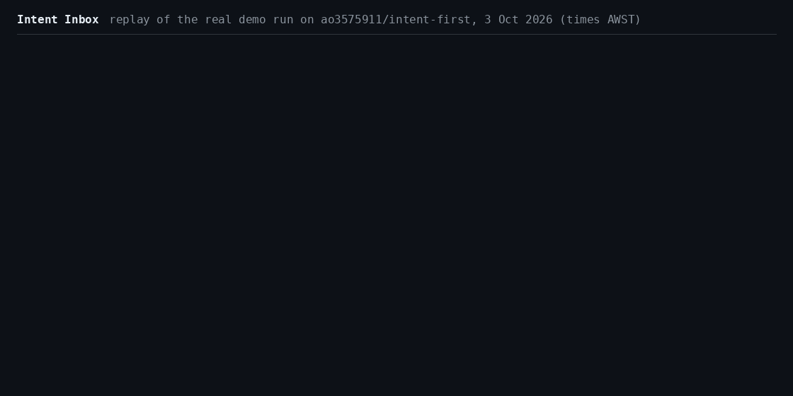

# intent-first

Commit the why: every pull request carries a short intent file, and CI checks the change against it.

[](https://github.com/ao3575911/intent-first/actions/workflows/proof-carrying-pr.yml?query=branch%3Amain)
[](https://github.com/ao3575911/intent-first/releases/latest)
[](LICENSE)



## Why

Git records what changed, not why. When agents write the diff, the instruction behind it is the part worth keeping, and it usually ends up in a chat log. intent-first keeps it in the repo as a small, reviewed file, and CI holds every pull request to it.

## The intent format

One file per change, at `.intent/YYYYMMDD-slug.md`:

```markdown
---
id: 20260928-rate-limit-login
status: draft
touches: [src/, tests/]
---
# Rate-limit failed logins

## Want
Max 5 failed logins per IP per minute.

## Not
No CAPTCHA. No lockout for users who log in successfully.

## Done when
- Limiter unit tests pass
  check: `python3 -m unittest discover -s tests`
- p95 login latency unchanged
```

- **One PR, one intent.** A PR adds exactly one intent, or references one draft with an `Intent: <id>` line in the PR body or a commit trailer.
- **Shipped is immutable.** Once `status: shipped` is on main, the file can't change. To change a decision, add a new intent with `supersedes: <old-id>`.
- **Done when is checked.** CI runs each `check:` command and fails the PR on a non-zero exit. Bullets without one go to human review.
- **Stay in scope.** Paths outside `touches:` get a warning, or fail with `strict-touches: "true"`.

## Quickstart

Add `.github/workflows/intent-check.yml`, then make `intent-check` a required status check:

```yaml
name: intent-check
on:
  pull_request:
    types: [opened, synchronize, reopened, edited]
permissions:
  contents: read
jobs:
  intent-check:
    runs-on: ubuntu-latest
    steps:
      - uses: actions/checkout@v5
        with: {fetch-depth: 0}
      - uses: ao3575911/intent-first@v1
```

Put your first intent in the same PR. If a PR carries a sealed agent session from [agent-session-recorder](https://github.com/ao3575911/agent-session-recorder) at `.proof/<intent-id>.json`, the action verifies it too.

To trace any line back to its intent, install `git why`:

```sh
curl -fsSL https://raw.githubusercontent.com/ao3575911/intent-first/v1/bin/git-why -o ~/.local/bin/git-why && chmod +x ~/.local/bin/git-why
git why src/ratelimit.py:21   # commit, intent, status, PR, and its Want / Not / Done when
```

## Intent Inbox

Write the intent and let any coding agent or person build it. CI picks the winner.

1. Anyone proposes an intent by PR into `.intent/open/`. The `intent-intake` check fails until an owner, member or collaborator other than the PR author approves the PR's latest commit.
2. Once it merges, the inbox opens an issue labelled `intent-open` with the intent and how to claim it.
3. Claim PRs put `Claims: <id>` in the body, and intent-check runs that intent's `check:` lines on each one.
4. The first claim whose CI passes is squash-merged at the SHA that passed, and the other claims are closed with a comment. A sweep every 30 minutes retries passing claims that weren't merged. A claim that's behind the base branch gets one comment asking for an update.
5. The issue is closed with the `shipped` label. That closed issue is the record that the intent is done, so intent files never move or change. An intent can be claimed only while its issue is open: close the issue as not planned to retire it.

Add two workflows, and make `intent-intake` a required status check. Turn on "Require branches to be up to date" too; the inbox waits for a behind claim to be updated instead of merging it stale.

```yaml
# .github/workflows/intent-intake.yml
name: intent-intake
on:
  pull_request: {types: [opened, synchronize, reopened]}
  pull_request_review: {types: [submitted, dismissed]}
permissions: {contents: read, pull-requests: read}
jobs:
  intent-intake:
    runs-on: ubuntu-latest
    steps:
      - uses: ao3575911/intent-first/inbox@v1
        with: {mode: intake}
```

```yaml
# .github/workflows/intent-inbox.yml
name: intent-inbox
on:
  push: {branches: [main], paths: [".intent/open/**"]}
  workflow_run: {workflows: [intent-check], types: [completed]}   # the name of your intent-check workflow
  schedule: [{cron: "*/30 * * * *"}]                              # the sweep
  workflow_dispatch:
permissions: {}
jobs:
  open:
    if: github.event_name == 'push'
    runs-on: ubuntu-latest
    permissions: {contents: read, issues: write}
    steps:
      - uses: actions/checkout@v5
        with: {fetch-depth: 0, persist-credentials: false}
      - uses: ao3575911/intent-first/inbox@v1
        with: {mode: open}
  claims:
    if: github.event_name != 'push' && (github.event_name != 'workflow_run' || (github.event.workflow_run.event == 'pull_request' && github.event.workflow_run.conclusion == 'success'))
    runs-on: ubuntu-latest
    permissions: {pull-requests: read, actions: read}
    outputs: {claims: "${{ steps.c.outputs.claims }}"}
    steps:
      - id: c
        uses: ao3575911/intent-first/inbox@v1
        with: {mode: claims, workflow: intent-check.yml}   # the file name of that workflow
  ship:
    needs: claims
    if: needs.claims.outputs.claims != '[]'
    runs-on: ubuntu-latest
    strategy: {fail-fast: false, matrix: {include: "${{ fromJSON(needs.claims.outputs.claims) }}"}}
    concurrency: {group: "intent-inbox-ship-${{ matrix.intent }}", cancel-in-progress: false}
    permissions: {contents: write, pull-requests: write, issues: write, actions: read}
    steps:
      - uses: ao3575911/intent-first/inbox@v1
        with: {mode: ship, run-id: "${{ matrix.run }}"}   # protect: "scripts/" keeps claims out of more paths
```

An intent without `check:` lines can't be claimed: its issue says so, and claim PRs fail. To assign each new issue to Copilot coding agent, set `assignees: copilot-swe-agent[bot]` on the `open` step. That needs a user token in `token:` and a Copilot plan that includes the coding agent.

## Inputs

`ao3575911/intent-first@v1` ([action.yml](action.yml)):

<!-- generated from action.yml -->
| Input | Default | Description |
|---|---|---|
| `base-ref` | `""` | Base commit or ref to diff against. Defaults to the pull request's base SHA. |
| `head-ref` | `""` | Head commit or ref to check. Defaults to the pull request's head SHA. |
| `strict-touches` | `false` | Fail (instead of warn) when a changed path is outside the intent's `touches:` list. |
| `run-checks` | `true` | Also run the `check:` commands listed in the intent's "Done when" section. |
| `run-checks-on-forks` | `false` | Also run `check:` commands on pull requests from forks. They are code written by the PR author, so this is off by default. |
| `proof-check` | `true` | Also verify sealed agent session proofs (.proof/<intent>.json) when a PR carries one. |
| `require-proof` | `false` | Fail PRs that carry no sealed session proof (.proof/<intent>.json). |

Output: `intent`, the intent id the PR is about (empty if none was found).

`ao3575911/intent-first/inbox@v1` ([inbox/action.yml](inbox/action.yml)):

<!-- generated from inbox/action.yml -->
| Input | Default | Description |
|---|---|---|
| `mode` | required | `intake` (on pull_request and pull_request_review), `open` (on push to the default branch), `claims` (on workflow_run, schedule or workflow_dispatch; outputs the passing claims) or `ship` (merges the claim whose run passed). |
| `token` | `${{ github.token }}` | Token for the GitHub API. |
| `assignees` | `""` | Optional comma-separated logins to assign each new intent issue to, e.g. copilot-swe-agent[bot]. Needs a user token. |
| `workflow` | `""` | For `claims` on a schedule. The file name of the workflow that runs intent-check on claim PRs, e.g. intent-check.yml. |
| `run-id` | `""` | For `ship`. The id of the CI run that passed. Defaults to the triggering workflow_run. |
| `protect` | `""` | For `ship`. Comma-separated paths a claim may never change, on top of .intent/ and .github/, e.g. action.yml,scripts/. |

Output: `claims`, from `claims` mode: a JSON list of `{intent, run}`, the earliest passing claim per intent.

## Security

- `run-checks` runs the `check:` commands written in the PR's intent, so it runs code from the PR author. Keep the workflow on `pull_request` with a read-only token and no secrets. Don't switch it to `pull_request_target`.
- PRs from forks skip `check:` commands unless `run-checks-on-forks` is `"true"`. A fork claim whose checks were skipped fails, so the inbox never merges it.
- A PR that changes `.intent/open/` needs an approving review on its latest commit from an owner, member or collaborator other than the PR author. Bot approvals don't count, and a new commit needs a new approval.
- The inbox's `claims` and `ship` jobs run code from the default branch, never check out the PR, and merge only the SHA that passed. A claim merges only if every changed file is inside the intent's `touches:` and none is under `.intent/`, `.github/` or a `protect:` path. They read every page of a PR's files; a PR with more than 3000 files is never merged or approved. Claim PRs can't change `.intent/`.
- This repo runs its own gate and the intake check from the PR's base commit, so a PR can't rewrite the checker that judges it. Consumers get the same by pinning `@v1`.
- A proof bundle shows that a session record wasn't altered. It doesn't show that the agent reported truthfully, or that the code is correct.
- Report vulnerabilities privately through [GitHub private vulnerability reporting](https://github.com/ao3575911/intent-first/security/advisories/new).

## Examples

[`examples/consumer/`](examples/consumer/) is a minimal consumer repo with a valid intent and a junk one. The [consumer-demo](.github/workflows/consumer-demo.yml) workflow runs the action against both on every push and asserts that the valid intent passes and the junk one fails. This repo's own [`.intent/`](.intent/) holds the intent behind every change to it.

## Contributing

See [CONTRIBUTING.md](CONTRIBUTING.md). Every PR needs an intent file. [Good first issues](https://github.com/ao3575911/intent-first/labels/good%20first%20issue) are a good place to start.

## License

[MIT](LICENSE)
